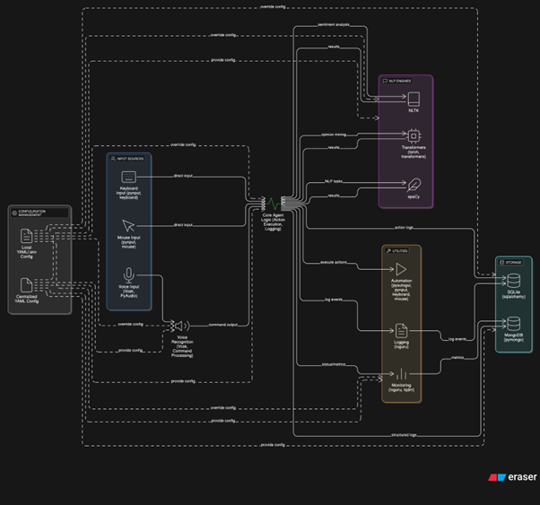

# Opinion-Mining-System

## Documentation

For detailed documentation, please refer to [SpokyAI Documentation](/SpokyAI/docs/README.md).

---

**About SpokyAI**

SpokyAI is an intelligent system designed to analyze and extract opinions from textual data. It leverages advanced natural language processing techniques to identify sentiment, categorize feedback, and provide actionable insights for decision-making.